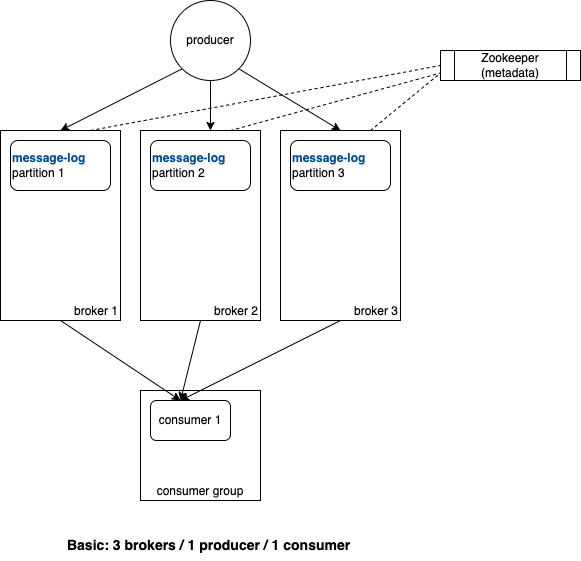

# Basic 



## Settings
| Name                     	| setting 	|
|--------------------------	|---------	|
| topic: replication factor | 1       	|
| topic: partitions         | 3       	|
| brokers count            	| 3       	|
| producer count           	| 1       	|
| consumer count           	| 1       	|
| -----------           	| ----     	|
| producer send           	| sync  	|
| -----------           	| ----      |
| MSG_COUNT                	| 100  	    |

### Pros
- producer send messages `synchronously`, order is guaranteed.

### Cons
- `replication-factor = 1`,  this is not good from a high-availability and reliability perspective. 
- producer send messages `synchronously`, lower throughput.
    - bottleneck is on producer side.


## Result
### Output Log (only 100 messages)
```
received 100 messages. 
total time consumption 93 seconds.
```

really slow.


## Ref
- https://github.com/conduktor/kafka-stack-docker-compose
- [Implementing a Kafka Producer and Consumer In Golang (With Full Examples) For Production](https://www.sohamkamani.com/golang/working-with-kafka/)